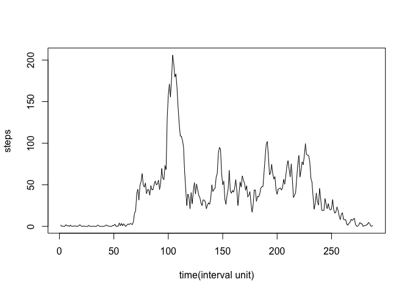

# Reproducible Research: Peer Assessment 1


## Loading and preprocessing the data
### 1. Processing the zip file and loading data


## What is mean total number of steps taken per day?
### 2. Histogram of the total number of steps taken each day
<!-- -->

### 3. Mean and median number of steps taken each day 

```
## [1] 10766.19
```

```
## [1] 10765
```


## What is the average daily activity pattern?
### 4. Time series plot of the average number of steps taken
<!-- -->

### 5. The 5-minute interval that, on average, contains the maximum number of steps

```
## [1] 104
```
The maximum number of steps happens at the 104th interval, it can been seen from the previous plot.


## Imputing missing values
### 6. Code to describe and show a strategy for imputing missing data
*The principal options for dealing with missing data are.
i: analysing only the available data (i.e. ignoring the missing data), 
ii: imputing the missing data with replacement values, and treating these as if they were observed (e.g. last observation carried forward, imputing an assumed outcome such as assuming all were poor outcomes, imputing the mean, imputing based on predicted values from a regression analysis);
and other two more complicate methods.*
http://handbook.cochrane.org/chapter_16/16_1_2_general_principles_for_dealing_with_missing_data.htm

This project mostly used the above first method. For the comparing purose, this section, I used the above 2nd method replacing missing data with the mean values calculated from the the first method.

```
## 'data.frame':	17568 obs. of  3 variables:
##  $ steps   : int  NA NA NA NA NA NA NA NA NA NA ...
##  $ date    : Factor w/ 61 levels "2012-10-01","2012-10-02",..: 1 1 1 1 1 1 1 1 1 1 ...
##  $ interval: int  0 5 10 15 20 25 30 35 40 45 ...
```

```
## [1] 2304
```

```
## [1] 37.3826
```

```
## [1] 37.3826
```
From the total 17568 observations, there are 2304 data are missing. As the missing data at the interval level were replaced by the mean, the mean after imputing remains the same as the previous one.

### 7. Histogram of the total number of steps taken each day after missing values are imputed
<!-- -->


## Are there differences in activity patterns between weekdays and weekends?
### 8. Panel plot comparing the average number of steps taken per 5-minute interval across weekdays and weekends
As the following plot shows, the patterns of the weekday activity and the weekend activity are different. Please note the interval is represented by minute in the plot.
<!-- -->
